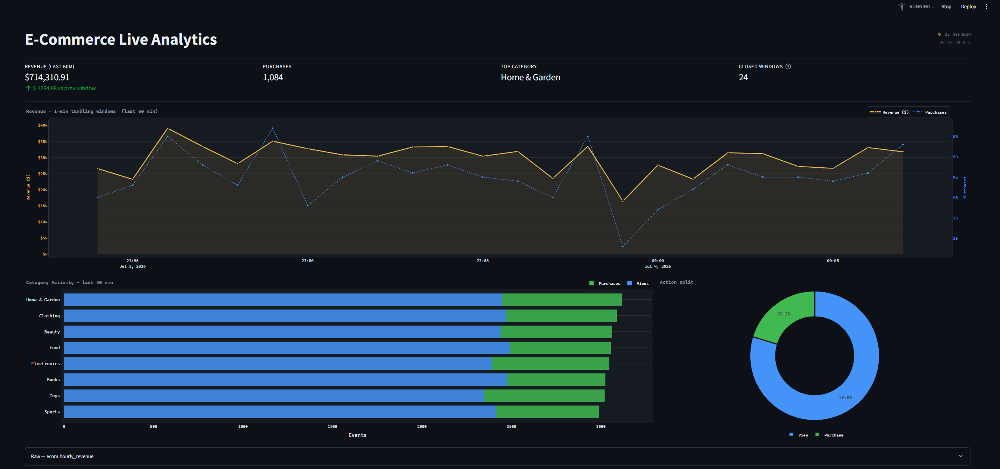

# Real-Time E-Commerce Streaming Analytics Pipeline

A 7-day incremental build of a production-grade streaming analytics pipeline using Python, Apache Kafka, PySpark Structured Streaming, PostgreSQL, and Streamlit — every component containerised with Docker Compose.



---

## Architecture

```
┌─────────────────────────────────────────────────────────────────────┐
│                         Docker Network                              │
│                                                                     │
│  ┌──────────┐     ┌─────────────┐     ┌─────────────────────────┐  │
│  │  Faker   │────▶│    Kafka    │────▶│   PySpark Structured    │  │
│  │ producer │     │  (KRaft)    │     │      Streaming          │  │
│  │          │     │  port 9092  │     │   master + 1 worker     │  │
│  └──────────┘     └─────────────┘     └───────────┬─────────────┘  │
│                                                   │                 │
│                                           foreachBatch              │
│                                                   │                 │
│                                       ┌───────────▼─────────────┐  │
│                                       │       PostgreSQL 15      │  │
│                                       │  ecom.hourly_revenue     │  │
│                                       │  ecom.category_metrics   │  │
│                                       └───────────┬─────────────┘  │
│                                                   │                 │
│                                       ┌───────────▼─────────────┐  │
│                                       │   Streamlit Dashboard   │  │
│                                       │      (Day 6–7)          │  │
│                                       └─────────────────────────┘  │
└─────────────────────────────────────────────────────────────────────┘
```

### Event schema (Kafka topic: `ecom.clickstream`)

| Field | Type | Example |
|---|---|---|
| `event_id` | UUID | `3f7a1c…` |
| `timestamp` | ISO-8601 UTC | `2026-07-01T10:00:00.123456+00:00` |
| `user_id` | string | `usr_abcd1234` |
| `session_id` | string | `sess_a1b2c3d4e5f6` |
| `product_id` | string | `laptop_0042` |
| `category` | string | `Electronics` |
| `action` | enum | `view` · `add_to_cart` · `purchase` |
| `price` | float | `849.99` |
| `page_url` | string | `/electronics/laptop` |

---

## Tech Stack

| Layer | Technology |
|---|---|
| Data generation | Python 3.11 + Faker |
| Message broker | Apache Kafka 3.x (KRaft, no Zookeeper) |
| Stream processing | PySpark 3.5 Structured Streaming |
| Storage | PostgreSQL 15 |
| Orchestration | Docker Compose |
| Dashboard | Streamlit *(Day 6–7)* |

---

## Directory Structure

```
e-com-streaming-analytics/
├── .env                    # local secrets (gitignored)
├── .env.example            # committed config template
├── docker-compose.yml      # all services
├── db/
│   └── init.sql            # schema + table DDL
├── producer/
│   ├── Dockerfile
│   ├── requirements.txt
│   └── generator.py        # Faker clickstream producer
├── consumer/
│   ├── Dockerfile          # apache/spark:3.5 + Kafka JARs
│   ├── requirements.txt
│   └── stream_processor.py # windowed aggregations → PostgreSQL
├── dashboard/
│   ├── Dockerfile
│   ├── requirements.txt
│   ├── app.py              # Streamlit live dashboard
│   └── .streamlit/
│       └── config.toml     # dark theme
└── docs/
    └── dashboard.png       # screenshot
```

---

## Prerequisites

- Docker Desktop ≥ 4.x with **at least 4 GB RAM** allocated to Docker
- `docker compose` v2 (bundled with Docker Desktop)
- No local Python or Java installation required — everything runs in containers

---

## Quick Start

```bash
# 1. Clone and configure
git clone https://github.com/KouhouMed/e-com-streaming-analytics.git
cd e-com-streaming-analytics
cp .env.example .env          # edit credentials if needed

# 2. Build images and start all services
#    First run downloads ~500 MB of base images and Kafka JARs
docker compose up -d --build

# 3. Check all services are healthy (allow ~60 s for Kafka/Spark to boot)
docker compose ps

# 4. Watch the producer and stream processor
docker compose logs -f producer
docker compose logs -f stream-processor
```

> **Tip:** Set `WATERMARK_DURATION=1 minute` in `.env` for faster console output during development. With the default 10-minute watermark, aggregated rows first appear in PostgreSQL roughly 11 minutes after the producer starts.

---

## Services & Ports

| Service | URL | Purpose |
|---|---|---|
| Kafka broker | `localhost:9092` | External bootstrap address (host → container) |
| Spark Master UI | http://localhost:8080 | Cluster overview and running apps |
| Spark Worker UI | http://localhost:8081 | Worker resource usage |
| Spark App UI | http://localhost:4040 | Active streaming query DAGs |
| PostgreSQL | `localhost:5432` | OLAP sink (`ecom_db`) |
| Streamlit *(Day 7)* | http://localhost:8501 | Real-time dashboard |

---

## Environment Variables

All variables live in `.env` (gitignored). Copy from `.env.example` to get started.

| Variable | Default | Description |
|---|---|---|
| `KAFKA_EXTERNAL_PORT` | `9092` | Host-facing Kafka port |
| `KAFKA_INTERNAL_PORT` | `29092` | Container-to-container Kafka port |
| `KAFKA_TOPIC_CLICKSTREAM` | `ecom.clickstream` | Main event topic |
| `CLUSTER_ID` | `4L6g3nShT-eMCtK--X86sw` | KRaft cluster ID |
| `EVENTS_PER_SECOND` | `5` | Producer throughput |
| `WATERMARK_DURATION` | `10 minutes` | Late-data tolerance |
| `REVENUE_WINDOW_DURATION` | `1 minute` | Tumbling revenue window size |
| `ACTIVITY_WINDOW_DURATION` | `5 minutes` | Sliding action-count window size |
| `ACTIVITY_SLIDE_DURATION` | `1 minute` | Sliding window step |
| `POSTGRES_HOST` | `postgres` | PG host (use container name inside Docker) |
| `POSTGRES_PORT` | `5432` | PG port |
| `POSTGRES_DB` | `ecom_db` | Database name |
| `POSTGRES_USER` | `ecom_user` | Database user |
| `POSTGRES_PASSWORD` | `ecom_pass` | Database password |
| `SPARK_WORKER_MEMORY` | `2G` | Memory per Spark worker |
| `SPARK_WORKER_CORES` | `2` | CPU cores per Spark worker |

---

## Verifying the Pipeline

**Kafka — confirm events are flowing:**
```bash
docker exec kafka kafka-console-consumer \
  --bootstrap-server localhost:9092 \
  --topic ecom.clickstream \
  --from-beginning --max-messages 3
```

**PostgreSQL — check aggregated results:**
```sql
-- Revenue per 1-minute window (most recent first)
SELECT window_start, window_end, total_revenue, purchase_count
FROM ecom.hourly_revenue
ORDER BY window_start DESC
LIMIT 10;

-- Action counts per category in 5-minute windows
SELECT window_start, category, action, event_count
FROM ecom.category_metrics
ORDER BY window_start DESC, event_count DESC
LIMIT 20;
```

Run via Docker:
```bash
docker exec postgres psql -U ecom_user -d ecom_db \
  -c "SELECT * FROM ecom.hourly_revenue ORDER BY window_start DESC LIMIT 5;"
```

**Apply DB schema to an already-running Postgres (no volume reset needed):**
```bash
docker exec -i postgres psql -U ecom_user -d ecom_db < db/init.sql
```

---

## Day-by-Day Build Log

| Day | Objective | Status |
|---|---|---|
| 1 | Project scaffold · Kafka (KRaft) + PostgreSQL via Docker Compose | ✅ Done |
| 2 | Faker-based Kafka producer (`generator.py`) with graceful shutdown | ✅ Done |
| 3 | PySpark Structured Streaming baseline — Kafka read + console sink | ✅ Done |
| 4 | Windowed aggregations — 1-min tumbling revenue · 5-min sliding action counts · 10-min watermark | ✅ Done |
| 5 | PostgreSQL persistence via `foreachBatch` + psycopg2 upserts | ✅ Done |
| 6 | Streamlit real-time dashboard — live charts from PostgreSQL | ✅ Done |
| 7 | Polish — alerts, auto-refresh, deployment notes | 🔜 Pending |

---

## Kafka Listener Model

Three listeners are configured so containers and the host machine can both reach the broker:

| Listener | Address | Used by |
|---|---|---|
| `PLAINTEXT_HOST` | `localhost:9092` | Host machine (CLI tools, local scripts) |
| `PLAINTEXT` | `kafka:29092` | Other Docker containers (producer, consumer) |
| `CONTROLLER` | `kafka:29093` | KRaft internal consensus (not exposed) |

---

## Teardown

```bash
docker compose down          # stop containers, keep volumes (data survives)
docker compose down -v       # stop containers and delete all volumes (full reset)
```
